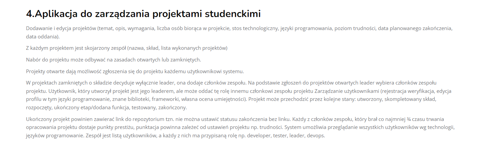

# StuddyBuddy

## Student project management application.

## Plan

In order to build the project I will start for defining how domain will look like.

For that I will:

1. Identify the Core Domain
2. Define Ubiquitous Language
3. Identify Bounded Contexts
4. Define Entities
5. Define Aggregates

## Core Domain

**Projects**: The application revolves around creating, editing, and managing projects. Projects have various attributes such as topic, description, requirements, technology stack, programming languages, level of difficulty, and dates associated with them.

**Teams**: Each project is associated with a team that consists of members. Teams have names, membership information, and a list of completed projects.

**Project Recruitment**: The application supports project recruitment, which can be done on an open or closed basis. Open projects allow any user of the system to apply, while closed projects have a leader who decides the composition of the team.

**Roles and Leadership**: Users within the system can have different roles within a project, such as developer, tester, leader, or devops. The user who creates a project initially becomes its leader but can transfer this role to another member of the project team.

**Project Workflow**: Projects progress through different states, including created, completed composition, started, completed stage/added feature, tested, and completed. These states represent the various stages of a project's lifecycle.

**User Management**: The application includes user management features like registration verification, profile editing, and skills assessment. Users can specify their programming languages, known libraries, frameworks, and other skills.

**Repository Link**: Completed projects require a link to the repository. A project cannot be marked as completed without providing this link.

**Prestige Points**: Team members who contribute a significant amount of time to a project receive prestige points. The scoring of these points depends on project settings, such as difficulty.

## Ubiquitous Language

**Project**: Represents a specific undertaking or assignment within the system. It has attributes such as a topic, description, requirements, technology stack, programming languages, level of difficulty, planned completion date, and handover date.

**Team**: Refers to a group of users collaborating on a project. A team is associated with a project and has a name, membership, and a list of completed projects.

**Project Recruitment**: Describes the process of seeking individuals to participate in a project. It can be conducted on an open or closed basis. Open projects allow any user to apply, while closed projects involve the leader selecting team members.

**Leader**: Denotes the user who initially creates a project and has the authority to make decisions about the project's composition and team membership. The leader can transfer this role to another team member.

**State**: Represents the various stages a project can go through. Potential states in this context include created, completed composition, started, completed stage/added feature, tested, and completed.

**User Management**: Encompasses activities related to managing user accounts and profiles within the application. It includes tasks such as registration verification, profile editing (including programming languages, known libraries, frameworks), and self-assessment of skills.

**Repository Link**: Refers to a hyperlink or URL that points to the repository associated with a completed project. A project cannot be marked as completed without providing this link.

**Prestige Points**: Quantifies the recognition or reputation gained by team members who contribute a significant portion of the project development time. The number of prestige points awarded depends on the project settings, such as its difficulty level.

**Technology and Programming Languages**: Pertains to the specific technologies and programming languages utilized by users within the system. The application allows users to view all users filtered by their technology and programming language skills.

**Role**: Represents the position or responsibility assigned to a user within a project team. Roles can include developer, tester, leader, devops, and potentially others.

## Bounded Contexts

**Project Management Context**:
 - Responsibilities: This context handles the core functionalities related to project management.
 
 - Key Concepts: Projects, Teams, Project Recruitment, Project States, User Roles.
 
 - Key Operations: Adding and editing projects, managing teams and their composition, handling project recruitment (open and closed), managing project states, assigning user roles.

**User Management Context**:
 - Responsibilities: This context focuses on user-related operations and profile management.
 
 - Key Concepts: User Accounts, Registration Verification, Profile Editing, Skills Assessment.
 
 - Key Operations: User registration and verification, profile editing (including programming languages, known libraries, frameworks), self-assessment of skills.

## Entities

**Project**: Represents a specific project with attributes such as topic, description, requirements, number of participants, technology stack, programming languages, level of difficulty, planned completion date, and handover date. It has a unique identity and lifecycle.

**Team**: Represents a team associated with a project. It has attributes such as a name and a list of completed projects. It can be identified by its association with a specific project.

**User**: Represents a user of the application. Each user has their own account, profile, and role within a project team. Users have unique identities and can participate in multiple projects.

## Aggregates

**Project Aggregate**:
- Root Entity: Project
   
- Description: The Project aggregate consists of the Project entity as its root. It encapsulates the core information and behavior related to a project, including attributes such as topic, description, requirements, technology stack, programming languages, level of difficulty, planned completion date, and handover date. The Team entity and ProjectState value object are part of the Project aggregate, as they are closely associated with a project. The Project aggregate manages the lifecycle of a project, handles project recruitment, and tracks the project's state.

**Team Aggregate**:
- Root Entity: Team

- Description: The Team aggregate is centered around the Team entity, representing a group of users collaborating on a project. It includes attributes such as the team name and a list of completed projects. The Team aggregate manages the composition of the team, handles team member additions and removals, and assigns roles to users within the team. The User entity and Role value object are part of the Team aggregate, as they define the users and their roles within the context of a team.

**User Aggregate**:
- Root Entity: User

- Description: The User aggregate revolves around the User entity, representing an individual user within the application. It includes attributes such as user account information, registration status, profile details (including programming languages, known libraries, frameworks), and skills assessment. The User aggregate manages user registration, verification, and profile editing. Although there are no associated entities or value objects directly within this aggregate, the User entity interacts with other aggregates such as Project and Team through relationships.